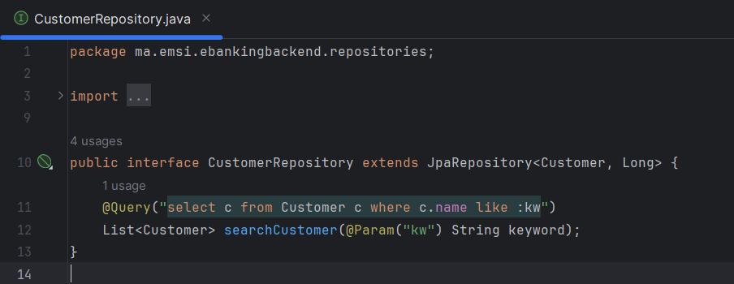

<h3>Compte Rendu</h3>

<h2>DTOs :</h2>

<h2>Entities :</h2>

<h2>Enums :</h2>

<h2>Exeptions :</h2>

<h2>Mapper :</h2>

<h2>Repositories :</h2>

<h2>Security :</h2>

<h2>Services :</h2>

<h2>Web:</h2>

<h2>Application :</h2>

<h2>Properties :</h2>

